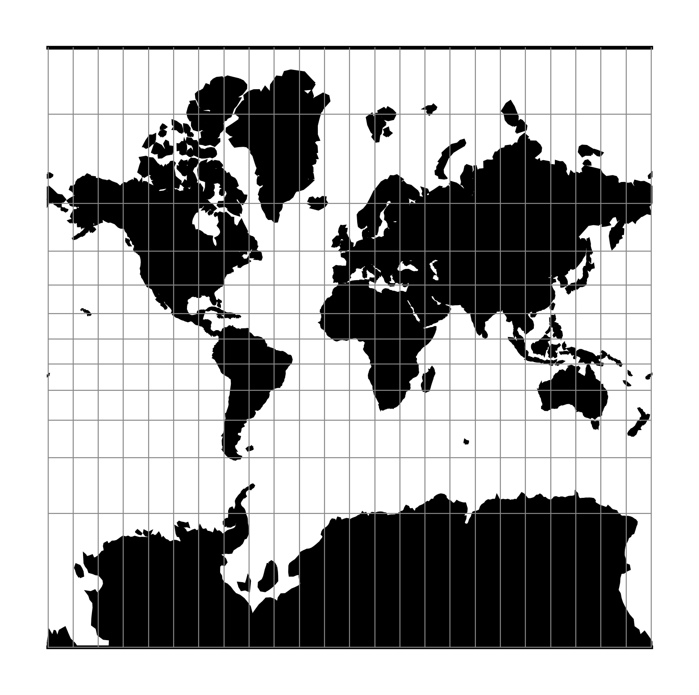
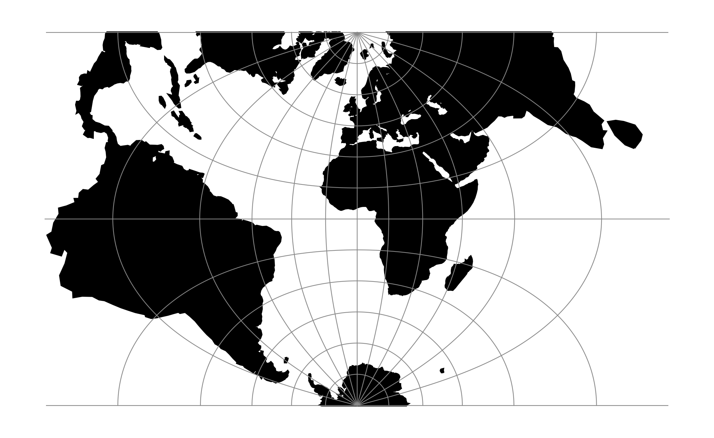
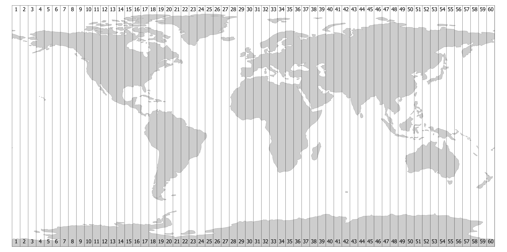
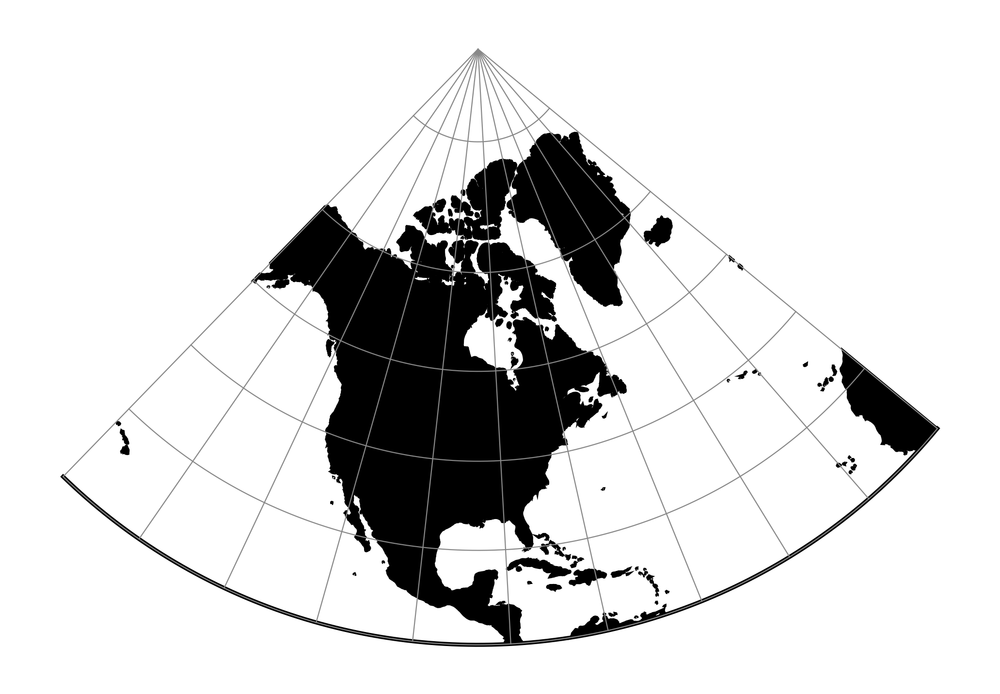
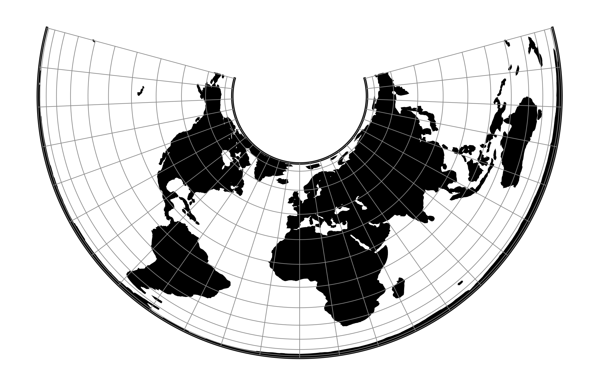
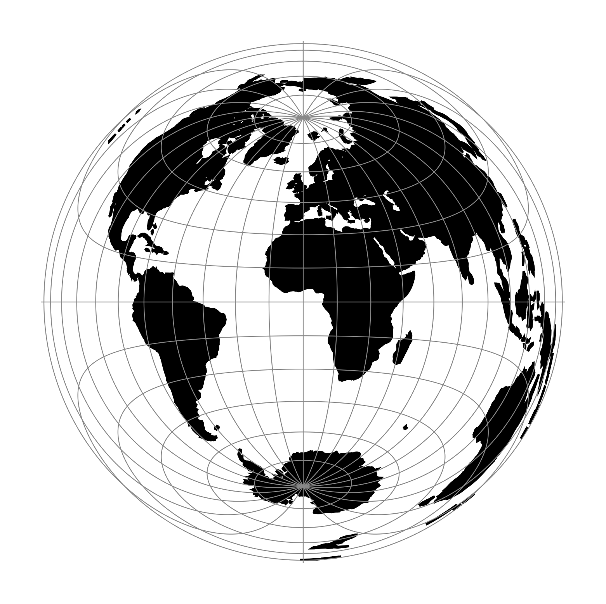
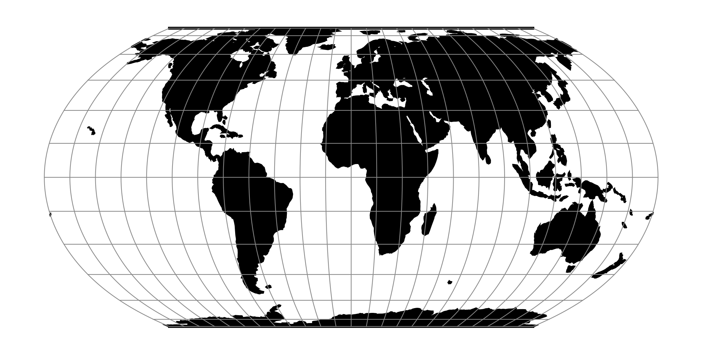
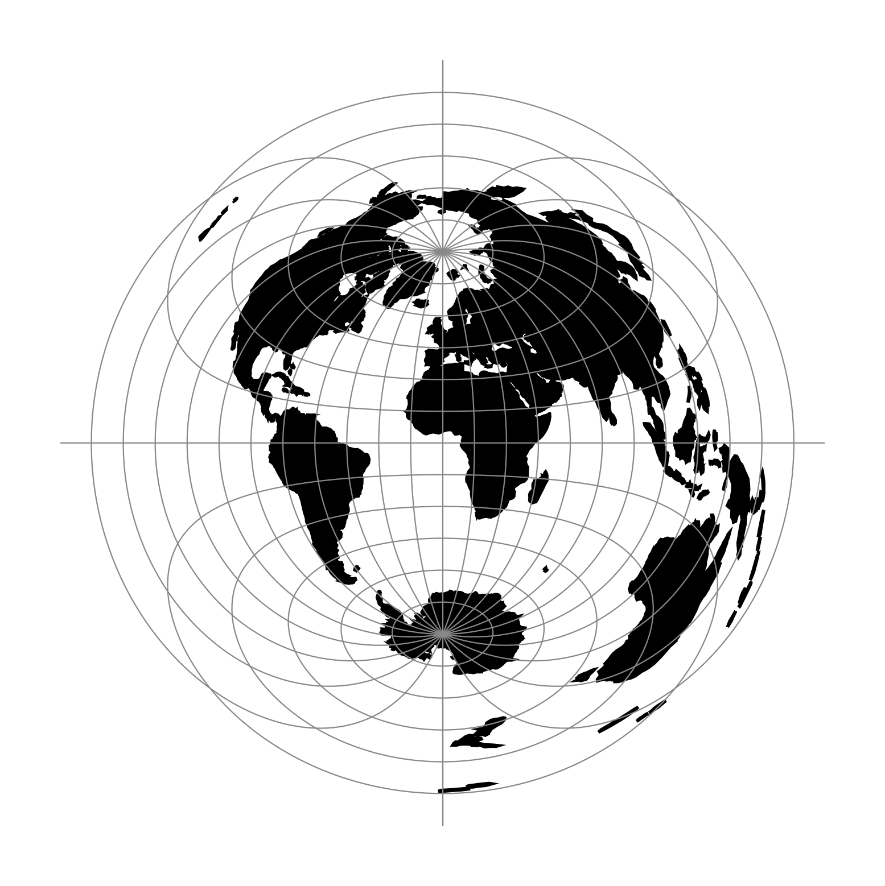
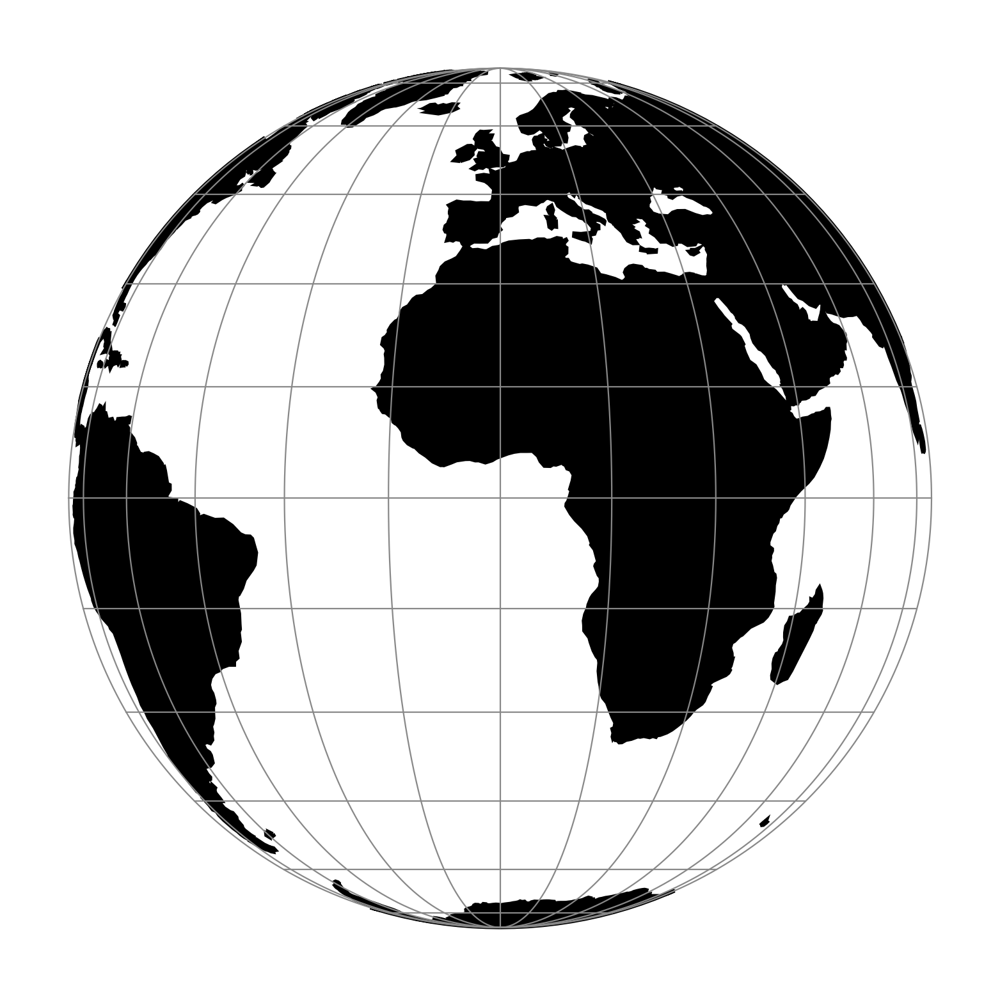

# Map Projections

A map projection converts positions on the curved Earth to a flat map. No projection can preserve shape, area, distance, and direction everywhere at the same time. The right choice therefore depends on the map's purpose and geographic extent.

A **coordinate reference system (CRS)** is broader than a projection: it also defines the datum, coordinate axes, units, and area of use. An **EPSG code** identifies one specific CRS. A projection name alone, such as “Mercator”, is not enough to interpret coordinates reliably.

## Planned initial *maptoy* support

Projection export is not implemented yet. The planned v1 export allowlist starts with three coordinate reference systems. Other projections described later on this page are useful context, but are not planned as initial export targets.

| CRS | What it is | Best use in *maptoy* | Important limitation |
| --- | --- | --- | --- |
| `EPSG:3857` — WGS 84 / Pseudo-Mercator | Projected Web Mercator coordinates, nominally in metres | XYZ source tiles, interactive slippy maps, and exports that should retain the familiar web-map appearance | Scale and area distortion grow rapidly toward the poles; unavailable beyond about 85.0511° north or south and unsuitable for precise measurement |
| `EPSG:4326` — WGS 84 | Geographic longitude and latitude in degrees; not a projected CRS | Input bounds, GPS/GeoJSON-style coordinate exchange, and exports on a longitude/latitude grid | Degrees are angular units, not constant ground distances; displaying them as a rectangle introduces Plate Carrée-like distortion |
| `EPSG:25833` — ETRS89 / UTM zone 33N | Projected Transverse Mercator coordinates in metres | Regional and topographic exports within UTM zone 33N, including eastern Germany and central Europe near 12°E–18°E | It is a zoned regional CRS, not a world map; use the appropriate UTM zone or local CRS outside its area of use |

An EPSG definition also specifies axis order. `EPSG:4326` formally uses latitude, longitude order, while GeoJSON and many web APIs conventionally use longitude, latitude. *maptoy* coordinate fields must label the order explicitly; never infer it from the two numbers alone.

## Projection properties

Projection families preserve different properties. “Preserves” always has a limited meaning: usually locally, along selected lines, or relative to a stated map purpose rather than everywhere.

- **Conformal** projections preserve local angles and small shapes. Mercator, Transverse Mercator, and Lambert Conformal Conic belong here. Area and scale can still be badly distorted.
- **Equal-area** projections preserve relative area, making them appropriate for thematic maps that compare quantities by region. Shapes and angles must change.
- **Equidistant** projections preserve distance only from particular points or along particular lines, never between every pair of points.
- **Azimuthal** projections are centred on one point and preserve directions or another chosen property from that centre, depending on the variant.
- **Compromise** projections balance several visible distortions without preserving one geometric property exactly.

## Widely used projections

### **Mercator and Web Mercator**

The classic [Mercator projection](https://proj.org/en/stable/operations/projections/merc.html) is conformal and turns a constant compass bearing into a straight line. That made it valuable for navigation. Web Mercator (`EPSG:3857`) uses a spherical calculation tailored to fast, square global tile pyramids and is the standard basis of XYZ web maps.

Web Mercator is excellent for interactive map navigation and tile compatibility, but poor for comparing areas or measuring at continental and global scales. Polar regions cannot be shown, and high-latitude places appear far too large.

### **Transverse Mercator and UTM**

[Transverse Mercator](https://proj.org/en/stable/operations/projections/tmerc.html) rotates the cylindrical construction so that distortion is small near a chosen central meridian. The Universal Transverse Mercator (UTM) system applies it in narrow longitudinal zones. Each zone has its own CRS and coordinates in metres.

[UTM](https://proj.org/en/stable/operations/projections/utm.html) is a strong choice for surveying, topographic maps, and regional measurements inside the correct zone. It is a poor choice for a map spanning many zones. `EPSG:25833` combines UTM zone 33N with the European ETRS89 datum.

### **Lambert Conformal Conic**

[Lambert Conformal Conic](https://proj.org/en/stable/operations/projections/lcc.html) is a conformal projection commonly used for mid-latitude regions with a large east–west extent. Distortion is controlled with one or two standard parallels. It is well suited to regional reference maps and aeronautical charts, but not to area comparison.

### **Albers and Lambert azimuthal equal-area**

[Albers Equal Area Conic](https://proj.org/en/stable/operations/projections/aea.html) is useful for large mid-latitude regions extending east to west. [Lambert Azimuthal Equal Area](https://proj.org/en/stable/operations/projections/laea.html) is often used for continents, hemispheres, and European statistical maps. Both preserve relative area and are therefore better than conformal projections for choropleths and other thematic comparisons.

### **Equal Earth**

[Equal Earth](https://proj.org/en/stable/operations/projections/eqearth.html) is a modern pseudocylindrical equal-area projection designed for world maps. It keeps the relative size of regions while producing a balanced overall appearance. It is a good publication choice when global area comparison matters, but it does not preserve local angles or distances.

### **Azimuthal equidistant and Orthographic**

[Azimuthal Equidistant](https://proj.org/en/stable/operations/projections/aeqd.html) preserves distance and direction from the map's centre, so it is useful for range maps centred on one location. [Orthographic](https://proj.org/en/stable/operations/projections/ortho.html) resembles a view of Earth from space and is effective for presentation. Neither preserves general distance or area across the whole map.

## Choosing a projection

| Goal | Sensible starting point |
| --- | --- |
| Display standard XYZ tiles interactively | Web Mercator (`EPSG:3857`) |
| Store or exchange longitude and latitude | WGS 84 (`EPSG:4326`), while treating it as geographic data rather than a flat measurement grid |
| Produce a metric regional map in UTM zone 33N | ETRS89 / UTM zone 33N (`EPSG:25833`) |
| Preserve local angles and recognizable small shapes | A conformal CRS designed for the map's region |
| Compare the area of countries or statistical regions | An equal-area projection appropriate to the map's extent |
| Show ranges or bearings from one centre | A suitable azimuthal projection centred on that location |

Do not choose a CRS only because its coordinates are expressed in metres. Check its datum, area of use, axis order, and preserved property. For analysis, calculate distance and area from the underlying geospatial data in a suitable CRS rather than measuring pixels in a rendered image.

## What reprojection changes

In v1, *maptoy* will normally receive XYZ raster tiles in Web Mercator. Exporting to another CRS warps the assembled raster onto a new pixel grid. This can bend previously straight edges, change the visible extent, leave transparent areas, and soften labels or lines through resampling. Reprojection cannot create detail that is absent from the source tiles.

The base map and every plugin layer must use the same transformation and output grid so that tracks and images stay aligned. Near the antimeridian, poles, or the edge of a CRS's area of use, an export may also need a split extent or may be rejected. Always retain the target CRS and output extent with an exported image if it will be used outside *maptoy*.

## Official references

- [EPSG:3857 — WGS 84 / Pseudo-Mercator](https://epsg.org/crs_3857/WGS-84-Pseudo-Mercator.html)
- [EPSG:4326 — WGS 84](https://epsg.org/crs_4326/WGS-84.html)
- [EPSG:25833 — ETRS89 / UTM zone 33N](https://epsg.org/crs_25833/ETRS89-UTM-zone-33N.html)
- [PROJ projection reference](https://proj.org/en/stable/operations/projections/index.html)

## More infos

- [Wikipedia](https://en.wikipedia.org/wiki/Map_projection)
