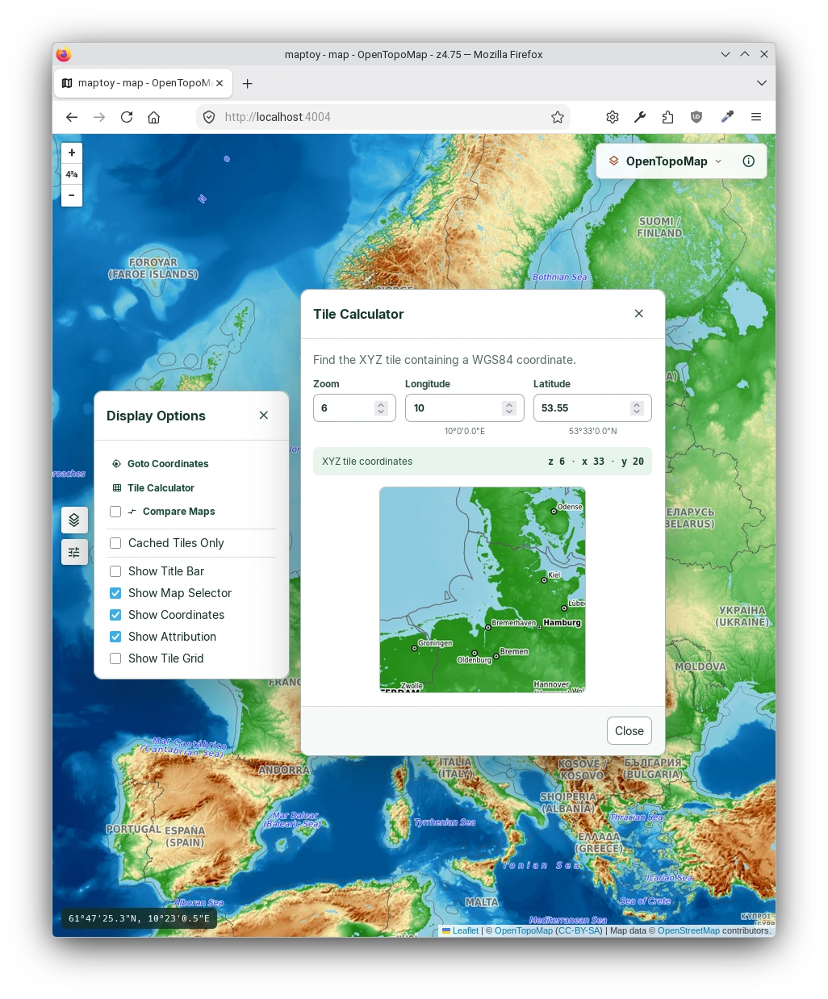
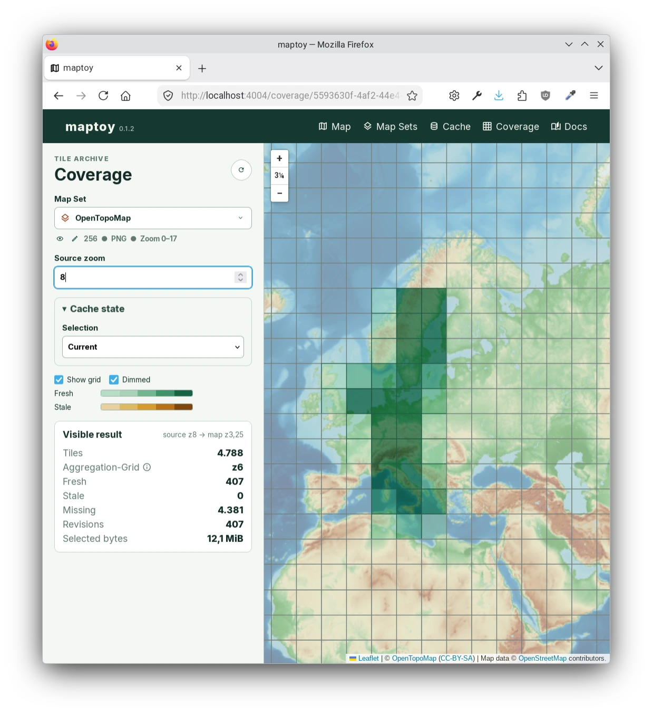
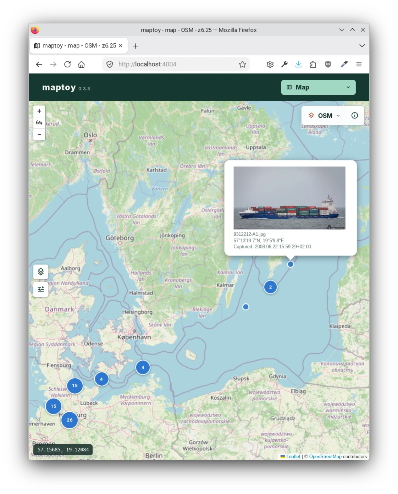
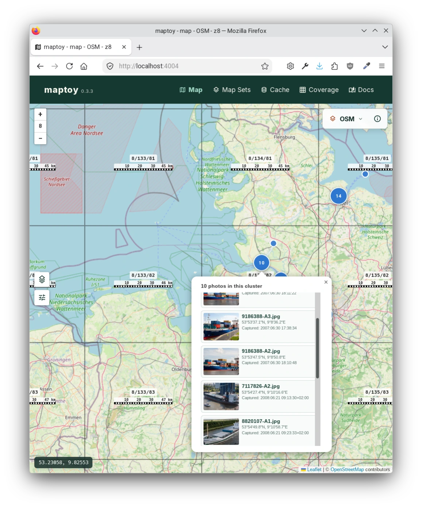
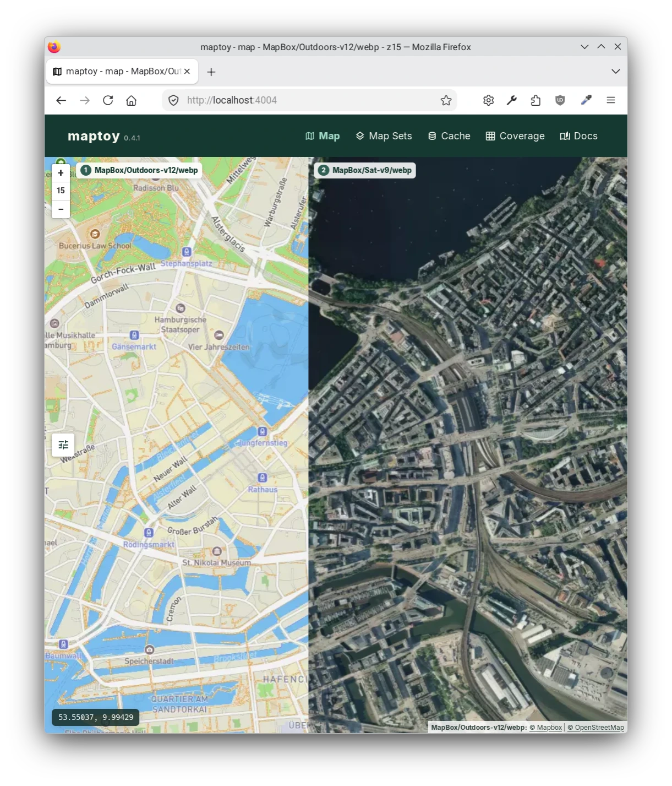
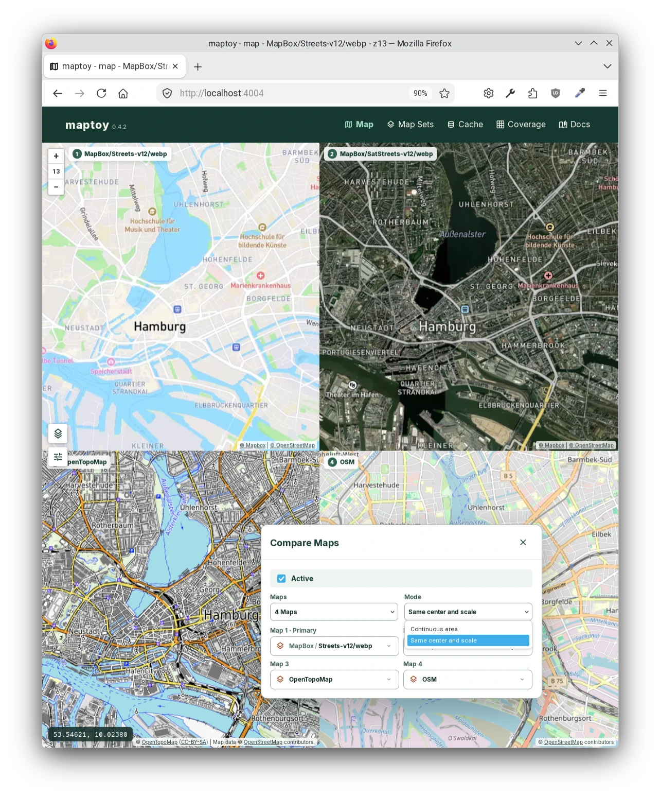

# Screenshots

A quick visual tour of selected *maptoy* tools and views.

**The interface continues to evolve, so details will differ from the current version.**

## Map

The standard Map view keeps coordinate navigation, Tile Calculator, display options, and Map Set selection.

## Cache Coverage

The Coverage view visualizes fresh, stale, and missing archive tiles at an appropriate aggregation level while retaining the geographic context.

## Photo Layers

These examples show a Photo Layer with clustered markers, an open preview popup, and the scrollable contents of a selected cluster.

## Compare Maps

Compare Maps displays two or four Map areas with synchronized pan and zoom. The first example compares street and satellite Map Sets side by side in continuous-area mode. The second shows four Map Sets sharing the same center and scale, with the Compare Maps settings open.

